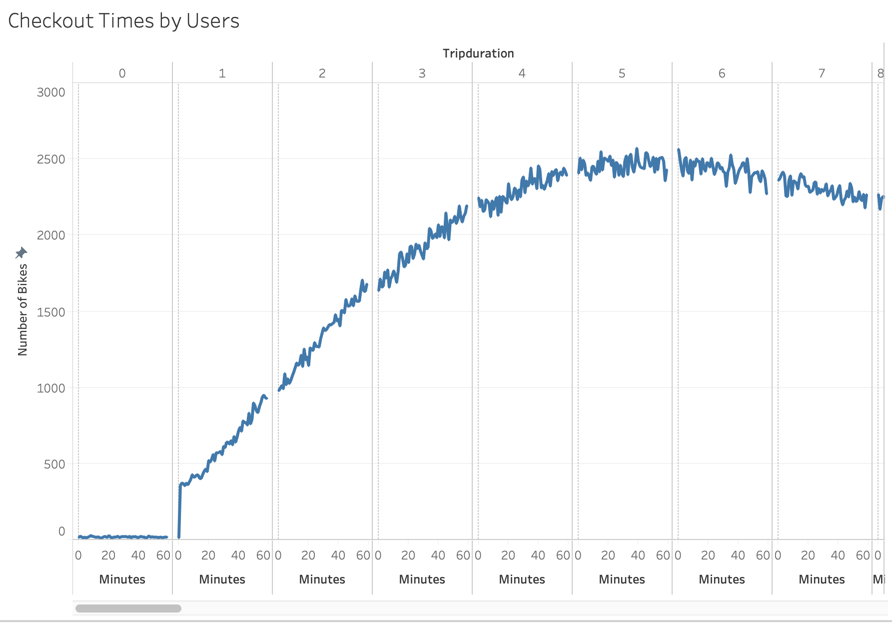
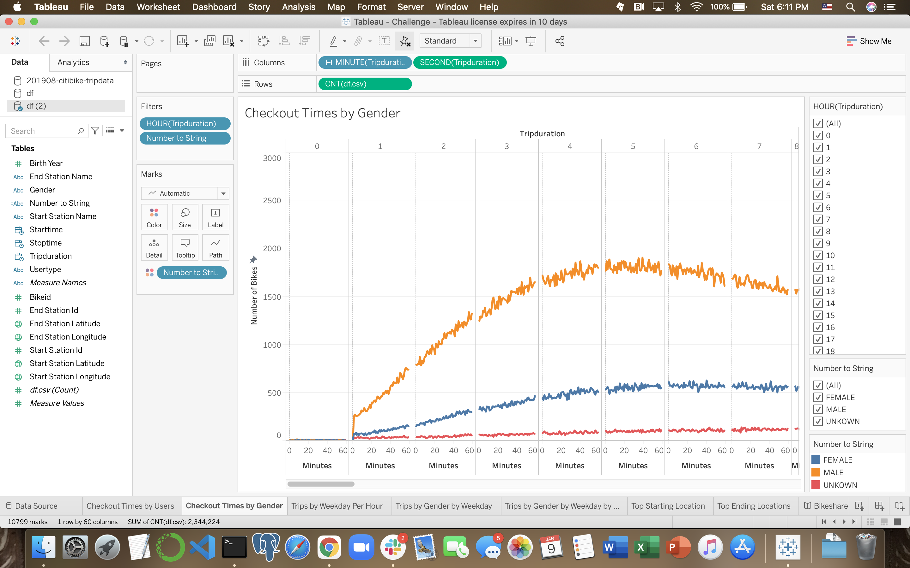
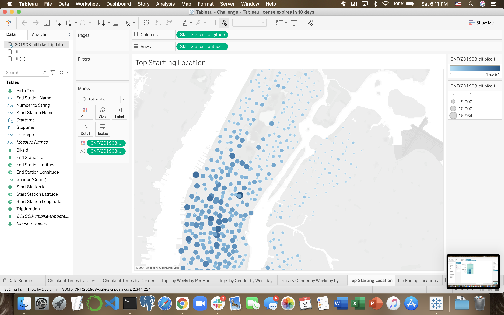
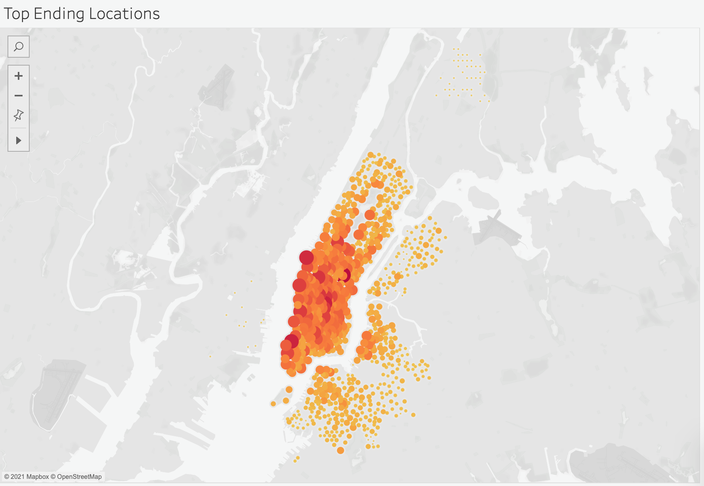
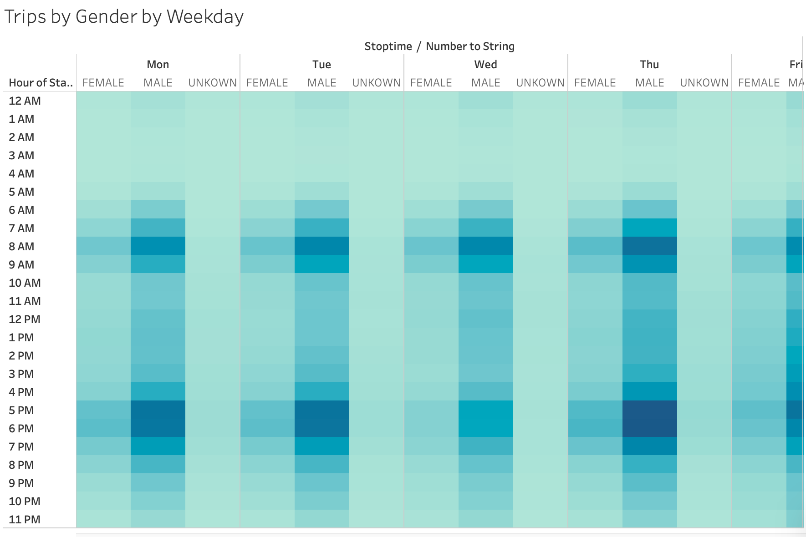
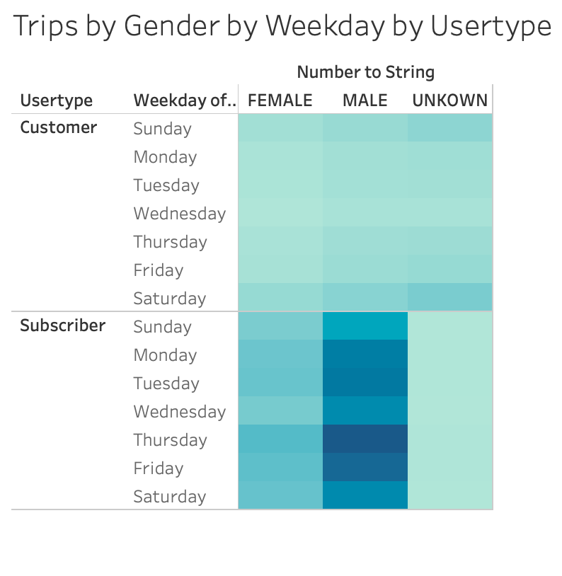

# Bikeshare Startup Tableau Visualizations

## Project Overview
In this project, the client requested detailed data visualizations using Tableau with the purpose of creating a business plan for a bikeshare startup. CSV files were provided containing CitiBike data from New York, which was used as a user behavior model for the proposed business.

## Results

This graph breaks the length of trips by the amount of bike rentals. As demonstrated by the graph, most bikes were rented and used for about 5 to 6 minutes.

This graph shows the amoutn of bikes rented and the amount of time they were rented for, as well as which gender rented them. This graph shows that men were the most frequent customers for Citibikes in august of 2019.

This graph shows the most popular starting locations for bike rentals. These locations would be good places to place bike rental stations.

This graph shows the most popular ending locations for bikes to be dropped off. These locations would be good for maintenance workers to pick up bikes.

This graph shows the most popular weekdays to rent bikes, broken down by the most popular hours. It appears that Thursday at 5 or 6 PM are the most popular times for people to rent bikes.

This graph is similar to the last, but breaks down the most popular days and times by gender. Again, this graph confirms that men are more likely to rent bikes, and that Thursday evening is the most popular time to rent bikes.

This graph takes the last graph and inserts a variable for usertype. This graph shows that subscribers are the most frequent customers, and subscribers are most likely to rent bikes on Thursdays.

## Summary

This data should prove useful in helping the client effectively implement a successful business strategy. The most important insights from these data visualizations are:
- The customer base is made up of more men than women.
- The most popular days to rent bikes are Thursdays, and the most popular time is 5 or 6 PM.
- The most frequent amount of trip durations were between 5 and 6 minutes.
- The most popular starting and ending locations are near scenic areas, where high concentrations of tourists are likely to be.

It should be noted that the insights gained from this data are promising, but the transition of these insights to a new geographic location with different customers could pose problems. The new user demographics and locations will have to be assessed prior to launch, and these insights should inform how the marketing and outreach is conducted. Further, the placement of bike stations near scenic locations where tourists frequent is more possible in a city like New York, as opposed to other cities which might have less tourists and scenic locations. All of this should be factored into the business strategy, and should inform the scale and launch of the business.

To provide more data towards the goal of launching a successful business, there are two additional visualizations that should be included. The first one is a demographic breakdown of usertype (customer or subscriber), gender, and age. This visualiztion would help to further target the demographic that is most likely to become paying subscribers for the bikeshare service. The other visualization that would be helpful is a 
