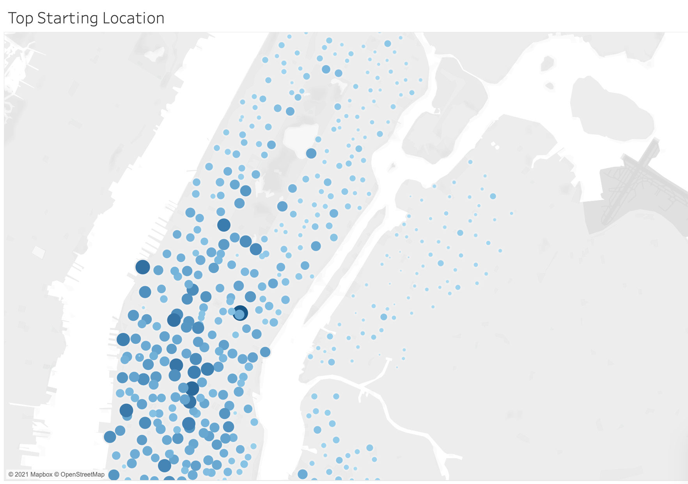
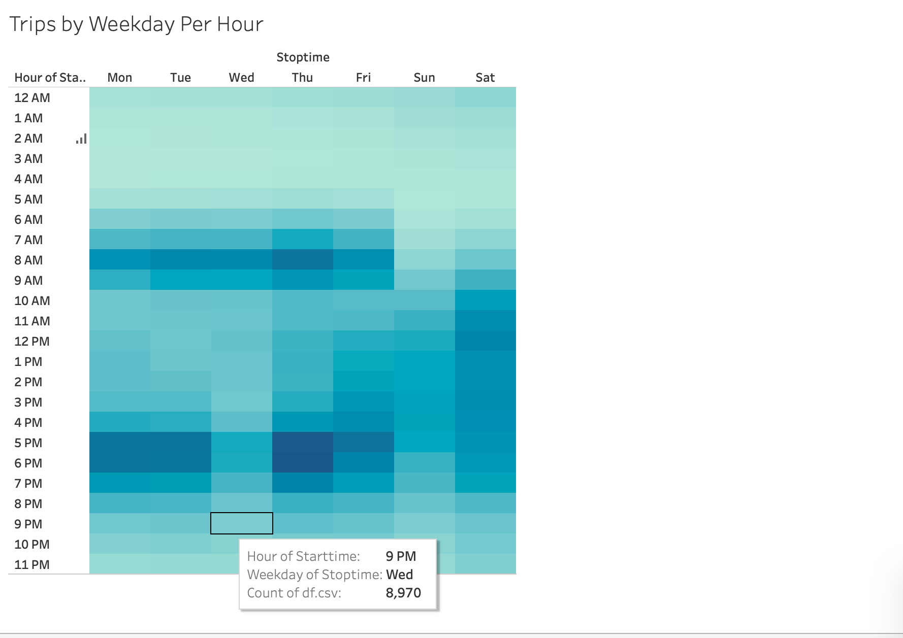

# Bikesharing Startup Tableau Visualizations

## Project Overview
In this project, the client requested detailed data visualizations using Tableau with the purpose of creating a business plan for a bikeshare startup. CSV files were provided containing CitiBike data from New York, which was used as a user behavior model for the proposed business.

## Results

This graph breaks the length of trips by the amount of bike rentals. As demonstrated by the graph, most bikes were rented and used for about 5 to 6 minutes.

This graph shows the amoutn of bikes rented and the amount of time they were rented for, as well as which gender rented them. This graph shows that men were the most frequent customers for Citibikes in august of 2019.

This graph shows the most popular starting locations for bike rentals. These locations would be good places to place bike rental stations.

This graph shows the most popular ending locations for bikes to be dropped off. These locations would be good for maintenance workers to pick up bikes.

This graph shows the most popular weekdays to rent bikes, broken down by the most popular hours. It appears that Thursday at 5 or 6 PM are the most popular times for people to rent bikes.

This graph is similar to the last, but breaks down the most popular days and times by gender. Again, this graph confirms that men are more likely to rent bikes, and that Thursday evening is the most popular time to rent bikes.

This graph takes the last graph and inserts a variable for usertype. This graph shows that subscribers are the most frequent customers, and subscribers are most likely to rent bikes on Thursdays.
